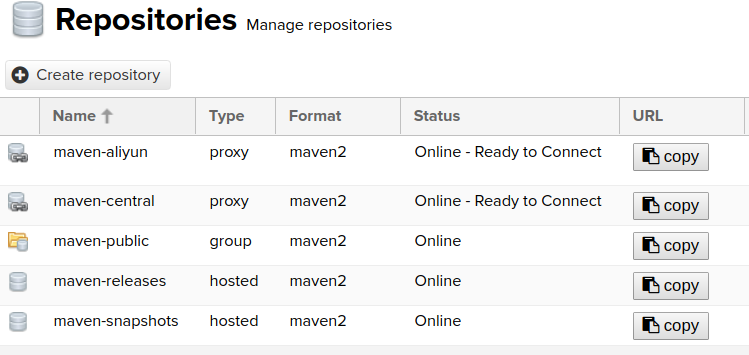
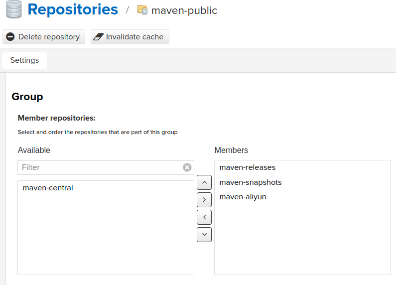

# 搭建Maven代理仓库

**版本信息**

| 版本号 | 日期       | 作者   | 描述 |
| ------ | ---------- | ------ | ---- |
| v1.0   | 2018-07-08 | kshell |      |

**目录**

[TOC]

## 一：环境

| 项目     | 版本号                               |
| -------- | ---------------------------------- |
| 操作系统 | Linux Mint 18.3 Sylvia 64 位         |
| 内核版本 | Linux 4.13.0-43-generic x86_64       |
| 运行平台 | Docker version 1.13.1, build 092cba3 |

## 二：Nexus2安装配置

### 1：安装

```
sudo docker pull sonatype/nexus
sudo mkdir /opt/share/nexus-data-2 
sudo chown -R 200 /opt/share/nexus-data-2
docke run --name nexus2 -d --network custmer --ip 172.172.0.9 -v /opt/share/nexus-data-2:/sonatype-work sonatype/nexus:latest
```

### 2：参数描述

| 参数                                      | 描述                                                         |
| ----------------------------------------- | ------------------------------------------------------------ |
| --name nexus2                             | 容器名称：nexus2                                             |
| -d                                        | 以服务方式运行                                               |
| --network custmer                         | 指定网络使用虚拟网桥custmer                                  |
| --ip 172.172.0.9                          | 指定容器ip为172.172.0.9                                      |
| -v /opt/share/nexus-data-2:/sonatype-work | 将宿主机目录/opt/share/nexus-data-2映射到容器目录/sonatype-work |

### 3：配置（略）

## 三：基于Nexus3的maven代理仓库安装配置

### 1：安装

```
sudo docker pull sonatype/nexus3
sudo mkdir /opt/share/maven-proxy-data 
sudo chown -R 200 /opt/share/maven-proxy-data
docker run --name maven-proxy --restart=always -d --network custmer --ip 172.172.0.5 -v /opt/share/maven-proxy-data:/nexus-data sonatype/nexus3:latest
```

### 2：参数描述

| 参数                                       | 描述                                                         |
| ------------------------------------------ | ------------------------------------------------------------ |
| --name maven-proxy                         | 容器名称：maven-proxy                                        |
| -d                                         | 以服务方式运行                                               |
| --network custmer                          | 指定网络使用虚拟网桥custmer                                  |
| --ip 172.172.0.5                           | 指定容器ip为172.172.0.5                                      |
| -v /opt/share/maven-proxy-data:/nexus-data | 将宿主机目录/opt/share/maven-proxy-data映射到容器目录/nexus-data |
| --restart=always                           | 容器退出后自动重启，用于电脑开启自动启动                     |

### 3：配置

#### （1）：配置步骤清单

| 编号 | 配置项             |
| ---- | ------------------ |
| 1    | 登陆Nexus管理端    |
| 2    | 删除不需要的仓库   |
| 3    | 新增阿里云代理仓库 |
| 4    | 配置仓库组         |

#### （2）：管理地址和用户

| 项目     | 描述                    |
| -------- | ----------------------- |
| 管理地址 | http://172.172.0.5:8081 |
| 用户     | admin/admin123          |

#### （3）：增加阿里云代理仓库

| 仓库名称     | 远程URL                                              |
| ------------ | ---------------------------------------------------- |
| maven-aliyun | http://maven.kshell.cn:8081/repository/maven-aliyun/ |



#### （4）：配置仓库组

- 将maven-central仓库从maven-public仓库组的Members中移除

- 将maven-aliyun仓库加入到maven-public仓库组的Members中



#### （5）：仓库访问地址

- http://172.172.0.5:8081/repository/maven-public/


## 四：构建工具配置

### 1：描述

- Nexus3 启动速度比 Nexus 2 要慢
- Nexus3 运行速度比 Nexus2 要快
- Nexus3 不支持更新中央仓库的索引
- Nexus3 只能搜索到已经下载的组件
- Nexus3 不支持Nexus2中的maven组件坐标直接复制

### 2：Maven配置

- maven选用Nexus3作为代理仓库
- 修改~/.m2/settings.xml

```
<mirrors>
    <mirror>
        <id>maven-net-cn</id>
        <name>Maven China Mirror</name>
        <mirrorOf>*</mirrorOf>
        <url>http://172.172.0.5:8081/repository/maven-public/</url>
        </mirror>
</mirrors>
```

### 3：Gradle配置

- Gradle选用Nexus3作为代理仓库
- 修改~/.grade/init.gradle

```
allprojects {
    repositories {
        mavenLocal()
        maven {
            name "nexus3Repo"
            url "http://172.172.0.5:8081/repository/maven-public/"
        }
        maven {
            name "aliyunRepo"
            url "http://maven.aliyun.com/nexus/content/groups/public/"
        }
    }
}
```

### 4：Gradle查看仓库

- ${project}/build.gradle中加入任务showRepos
- 执行gradle showRepos

```
task showRepos << {
    println repositories.collect { "\n" + it.name + ":\n" + it.url + "\n" }
}
```

### 5：Gradle下载源码

- ${project}/build.gradle中加入配置
- 在IDEA中打开的项目中下载源码和Javadoc

```
apply plugin: 'eclipse'

eclipse{
    classpath{
        downloadSources=true
        downloadJavadoc=true
    }   
}
```

## 五：基于Nexus3的docker代理仓库安装配置

### 1：安装

```
sudo docker pull sonatype/nexus3
sudo mkdir /opt/share/docker-proxy-data 
sudo chown -R 200 /opt/share/docker-proxy-data
docker run --name docker-proxy --restart=always -d --network custmer --ip 172.172.0.6 -v /opt/share/docker-proxy-data:/nexus-data sonatype/nexus3:latest
```

### 2：参数描述

| 参数                                        | 描述                                                         |
| ------------------------------------------- | ------------------------------------------------------------ |
| --name docker-proxy                         | 容器名称：docker-proxy                                       |
| -d                                          | 以服务方式运行                                               |
| --network custmer                           | 指定网络使用虚拟网桥custmer                                  |
| --ip 172.172.0.6                            | 指定容器ip为172.172.0.6                                      |
| -v /opt/share/docker-proxy-data:/nexus-data | 将宿主机目录/opt/share/docker-proxy-data映射到容器目录/nexus-data |
| --restart=always                            | 容器退出后自动重启，用于电脑开启自动启动                     |


<meta http-equiv="refresh" content="3">