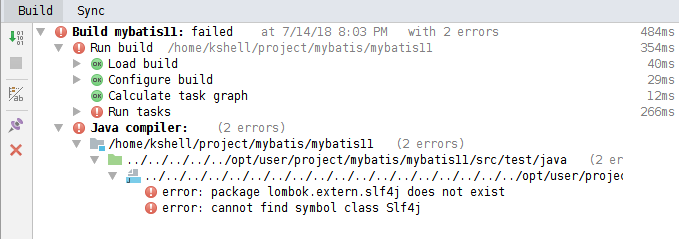

# MyBatis 整理

## 版本信息

| 版本号 | 日期       | 作者   | 描述 |
| ------ | ---------- | ------ | ---- |
| v1.0   | 2018-07-08 | kshell |      |

**目录**

[TOC]

## 一、环境

| 项目     | 版本号                                                |
| -------- | ----------------------------------------------------- |
| 操作系统 | Linux Mint 18.3 Sylvia 64 位                          |
| 内核版本 | Linux 4.13.0-43-generic x86_64                        |
| JDK      | java version "1.8.0_162" amd 64                       |
| IDE      | IntelliJ IDEA 2018.1.1 (Ultimate Edition)             |
| 数据库   | MariaDB-10.2.14+maria~jessie  (docker mariadb:latest) |
| MyBatis  | 3.4.6                                                 |
| Maven    | Apache Maven 3.5.2                                    |
| Gradle   | Gradle 4.6                                            |

## 二、简介

### 1、什么是MyBatis？

- MyBatis 是一款优秀的持久层框架，它支持定制化 SQL、存储过程以及高级映射。

- MyBatis 避免了几乎所有的 JDBC 代码和手动设置参数以及获取结果集。

- MyBatis 可以使用简单的 XML 或注解来配置和映射原生信息。

- MyBatis 可以将接口和 Java 的 POJOs(Plain Old Java Objects,普通的 Java对象)映射成数据库中的记录。

## 三、入门

### 1、安装

- 要使用 MyBatis， 只需将 [mybatis-3.4.6.jar](https://github.com/mybatis/mybatis-3/releases) 文件置于 classpath 中即可。 

**如果使用 Maven 来构建项目，则需将下面的 dependency 代码置于 pom.xml 文件中：**

```
<dependency>
	<groupId>org.mybatis</groupId>
	<artifactId>mybatis</artifactId>
	<version>3.4.6</version>
</dependency>
```

**示例项目完整的maven依赖如下：

```
	<dependencies>
		<dependency>
			<groupId>org.mybatis</groupId>
			<artifactId>mybatis</artifactId>
			<version>3.4.6</version>
		</dependency>
		<dependency>
			<groupId>ch.qos.logback</groupId>
			<artifactId>logback-classic</artifactId>
			<version>1.2.3</version>
		</dependency>
		<dependency>
			<groupId>org.projectlombok</groupId>
			<artifactId>lombok</artifactId>
			<version>1.16.20</version>
		</dependency>
		<dependency>
			<groupId>org.testng</groupId>
			<artifactId>testng</artifactId>
			<version>6.13.1</version>
		</dependency>
		<dependency>
			<groupId>mysql</groupId>
			<artifactId>mysql-connector-java</artifactId>
			<version>5.1.44</version>
		</dependency>
	</dependencies>
```

**如果使用 Gradle来构建项目，则需将下面的 dependency 代码置于 build.gradle文件中：**

```
compile('org.mybatis:mybatis:3.4.6')
```
**示例项目完整的Gradle依赖如下：

```
dependencies {
	compile('org.mybatis:mybatis:3.4.6')
	compile('ch.qos.logback:logback-classic:1.2.3')
	compileOnly('org.projectlombok:lombok:1.16.20')
	testCompile('org.testng:testng:6.13.1')
	runtime('mysql:mysql-connector-java:5.1.44')
}
```


## 错误汇总

### 1、找不到mybatis-config.xml 

#### （1）报错信息

```
java.io.FileNotFoundException: mybatis-config.xml (没有那个文件或目录)
```

#### （2）、错误分析和原因

- 使用如下代码块读取mybatis-config.xml创建SqlSessionFactor。

```
String resource = "mybatis-config.xml";
BufferedReader reader = new BufferedReader(new FileReader(resource));
sqlSessionFactory = new SqlSessionFactoryBuilder().build(reader);
```

- 使用FileReader读取配置文件是，并不能去classpath中查找。

- 改为**Resources.getResourceAsStream(resource);**才能正确读到配置文件

#### （3）、解决方法

- 读取mybatis-config.xml的代码调整如下：

```
String resource = "mybatis-config.xml";
InputStream stream = Resources.getResourceAsStream(resource);
sqlSessionFactory = new SqlSessionFactoryBuilder().build(stream);
```

- 注意：经测试使用Resources.getResourceAsReader(resource)也没能读取成功。

### 2、找不到Mapper文件

####  （1）、报错信息

```
org.apache.ibatis.binding.BindingException: Invalid bound statement (not found): cn.kshell.blog.mapper.BlogMapper.selectBlog
```
#### （2）、错误分析和原因

- Mapper interface和xml文件的定义对应不上，需要检查包名，namespace，函数名称等能否对应上。
- UserMapper.xml有没有正确被打包。
- **问题确认为UserMapper.xml没有被打包**

#### （3）、解决方法

- 方法一：将BlogMapper.xml从src目录下转移到resources下成功。
- 方法二：gradle处理。在gradle.build文件中增加如下配置。

```
  processResources {
  	from('src/main/java') {
  		include '**/*.xml'
  	}
  }
```

- Maven处理。在pom.xml文件中增加如下配置。

```
<build>
    <resources>  
        <!-- maven项目中src源代码下的xml等资源文件编译进classes文件夹，
        注意：如果没有这个，它会自动搜索resources下是否有mapper.xml文件，
        如果没有就会报org.apache.ibatis.binding.BindingException-->
        <resource>  
            <directory>src/main/java</directory>  
            <includes>  
                <include>**/*.xml</include>  
            </includes>  
        </resource>
        <!--将resources目录下的配置文件编译进classes文件  -->  
        <resource>
            <directory>src/main/resources</directory>
        </resource>
    </resources>  
</build>   
```

#### （5）、参考文献

- org.apache.ibatis.binding.BindingException: Invalid bound statement (not found)异常处理
- https://blog.csdn.net/jxm007love/article/details/78861759

- 解决：org.apache.ibatis.binding.BindingException: Invalid bound statement (not found):
- https://blog.csdn.net/gwd1154978352/article/details/68954224

- Gradle打包src中的资源文件的配置方法(mapper.xml等)
- https://blog.csdn.net/kingboyworld/article/details/78251425

### 3、数据库没有启动

#### （1）、报错信息

```
Caused by: java.net.NoRouteToHostException: 没有到主机的路由 (Host unreachable)
```

#### （2）、问题原因

- 没有启动数据库。

#### （3）、解决方法

- 启动数据库，重新测试。

### 4、IDEA+Gradle中使用 Lombok问题

#### （1）、报错信息

- 测试类中不能访问到Lombok中的注解
- 需要将Lombok的lib增加到classpath中，如下图：


- 编译测试类的过程中找不到Lombok中注解的符号
- 例如 lombok.extern.slf4j does not exist，如下图：



#### （2）、问题原因

- gradle.build中依赖lombok时，使用compileOnly作用域，不支持测试。如下：

```
compileOnly('org.projectlombok:lombok:1.16.20')
```

#### （3）、解决方法

- 改变依赖lombok的作用域，如下：

```
compile('org.projectlombok:lombok:1.16.20')
```

### IDEA问题


