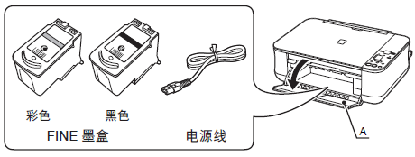
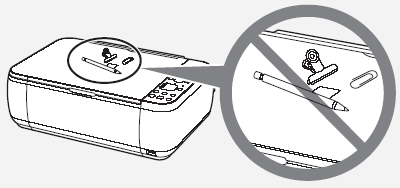
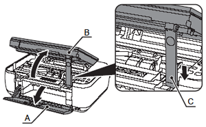
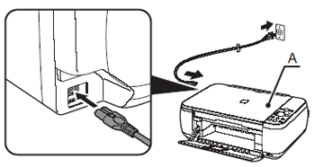
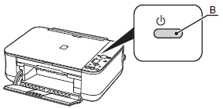
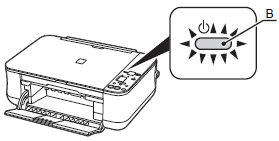
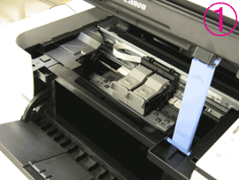

## 准备本机

### 解决方法

- 准备工作
- 取下保护材料
- 开启电源
- 安装FINE墨盒
- 装入纸张

### 准备工作

- 检查包装箱中物品

开启本机之前，取下所有的橙色胶带和保护片。



FINE 墨盒和电源线放置在出纸托盘(A)内部。

用双手打开出纸托盘，并取出FINE墨盒和电源线。

- 手册
- 安装光盘( 包括驱动程序、应用程序和电子手册)
- 其他文档

```
注释
USB 电缆线(A-B 型) 是连接本机和计算机所必需的。
```

```
须知
- 选择位置
```



```
请勿将本机安装在可能有物品坠落其上的地方。物品可能会掉入本机中，导致故障。
请勿在本机上放置任何物品。打开机盖时物品可能会掉入本机，导致故障。
```

### 取下保护材料

1. 打开出纸托盘(A)。



2. 抬起扫描单元( 机盖)(B)，并使用扫描单元支架(C) 将其固定。
3. 小心取下橙色胶带(D)。随橙色胶带一起取下保护材料(E)。


4. 轻轻地抬起扫描单元( 机盖)并折叠扫描单元支架，然后轻轻地关闭扫描单元( 机盖)。

### 开启电源

1. 将电源线一端插入本机的左侧，然后将另一端连接至壁装电源插座上。



```
须知
   - 请勿在此步骤连接USB 电缆线。
   - 确保文档盖板(A) 已关闭。
```

2. 开启本机(B)。



3. 确保电源指示灯(B) 亮起绿色。



### 安装FINE墨盒



### 装入纸张


