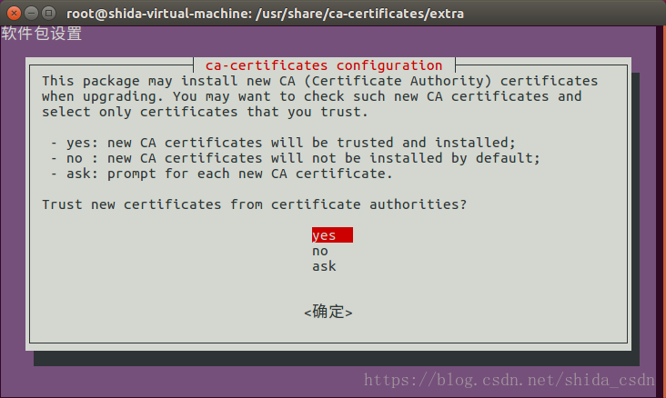

# 搭建Docker代理仓库

**版本信息**

| 版本号 | 日期       | 作者   | 描述 |
| ------ | ---------- | ------ | ---- |
| v1.0   | 2018-07-29 | kshell |      |

**目录**

[TOC]

## 一：环境

| 项目     | 版本号                               |
| -------- | ---------------------------------- |
| 操作系统 | Linux Mint 18.3 Sylvia 64 位         |
| 内核版本 | Linux 4.13.0-43-generic x86_64       |
| 运行平台 | Docker version 1.13.1, build 092cba3 |
| 仓库工具 | Sonatype Nexus3 （Docker镜像 sonatype/nexus3:latest） |

- docker容器预留配置
| 项目            | 描述                             |
| --------------- | -------------------------------- |
| 容器名称        | docker-proxy                     |
| 容器IP分配      | 172.172.0.6                      |
| 容器域名        | docker.kshell.cn                 |
| /etc/hosts 配置 | 172.172.0.6     docker.kshell.cn |

## 二：安装Nexus3

### 1：安装命令

```
sudo docker pull sonatype/nexus3
sudo mkdir /opt/share/docker-data 
sudo chown -R 200 /opt/share/docker-data
docker run --name docker-proxy --restart=always -d --network custmer --ip 172.172.0.6 -v /opt/share/docker-data:/nexus-data sonatype/nexus3:latest
```

### 2：安装脚本

- 可以使用该安装脚本代替安装命令
- 可修改脚本中的容器名称，ip地址，网关信息，映射目录，映射端口等选项
```
#!/bin/zh

# 创建docker-proxy容器脚本
# 名称: docker-proxy.sh

# 镜像名称 
IMG_NAME=sonatype/nexus3:latest
# 容器名称
CONT_NAME=docker-proxy
# 网关名称
CONT_NETWORK=custmer
# IP地址
CONT_IP=172.172.0.6

# 本地数据目录映射位置
LOCAL_DATA_DIR=/opt/share/docker-data
# 容器数据位置
CONT_DATA_DIR=nexus-data

PROT_OPT_1=""
PORT_OPT_2="-p 8081:8081 -p 8443:8443 -p 7000:7000 -p 7001:7001"

# 端口映射,如果不对外提供服务使用PROT_OPT_1
PORT=${PORT_OPT_2}

# 删除已经存在的同名容器
sudo docker rm -f ${CONT_NAME}

# 本地映射目录处理
sudo rm -rf ${LOCAL_DATA_DIR}
sudo mkdir -p ${LOCAL_DATA_DIR}
sudo chown -R 200 ${LOCAL_DATA_DIR}

# 创建容器
CMD="sudo docker run --name ${CONT_NAME} --restart=always -d --network ${CONT_NETWORK} --ip ${CONT_IP} ${PORT} -v ${LOCAL_DATA_DIR}:/${CONT_DATA_DIR} ${IMG_NAME}"
echo ${CMD}
eval ${CMD}
```


### 3：参数描述

| 参数                                  | 描述                                                        |
| ------------------------------------- | ----------------------------------------------------------- |
| --name docker-proxy                   | 容器名称：docker-proxy                                      |
| -d                                    | 以服务方式运行                                              |
| --network custmer                     | 指定网络使用虚拟网桥custmer                                 |
| --ip 172.172.0.6                      | 指定容器ip为172.172.0.6                                     |
| -v /opt/share/docker-data:/nexus-data | 将宿主机目录/opt/share/docker-data映射到容器目录/nexus-data |
| --restart=always                      | 容器退出后自动重启，用于电脑开启自动启动                    |

### 4：端口映射

- 如果需要对外提供服务，这需要将容器端口映射到宿主机上

- 通过访问宿主机的对应端口，就可以使用容器内的服务

- -p 宿主机端口：容器端口

- 例如：-p 8081:8081 -p 8443:8443 -p 7000:7000 -p 7001:7001

| 容器端口分配 | 描述                                                       |
| ------------ | ---------------------------------------------------------- |
| 8081         | http访问端口（onatype/nexus3默认）                         |
| 8443         | https访问端口（后面会配置该端口）                          |
| 7000         | docker本地仓库端口，用于上传本地镜像（https协,后续会配置） |
| 7001         | docker代理访问端口，用于下载镜像（https协,后续会配置）     |

## 三：Nexus3配置

### 1：管理地址和用户

| 项目     | 描述                    |
| -------- | ----------------------- |
| 管理地址 | http://172.172.0.6:8081 |
| 用户     | admin/admin123          |

### 2：清空所有仓库

略

### 3：仓库配置

#### （1）配置私有仓库

- Repository - Repositories - Create repository - 选择 docker（hosted）
- 填一个名称 docker-local（名称是自定义的）
- 勾上 HTTPS，填一个端口 7000（端口自定义）
- 注：该7000端口是用于上传镜像使用。如要对外提供服务，就需要在创建容器时将该端口通过-p 宿主机端口:容器端口的方式暴露出去。
- 勾上“Enable Docker V1 API"，其他均默认
- 点击 Create repository ，创建仓库

#### （2）国内加速镜像代理

- Repository - Repositories - Create repository - 选择 docker（proxy）
- 填一个名称 docker-hub-cn（名称是自定义的）
- 去掉 Force basic authentication 勾选，勾上“Enable Docker V1 API"
- 填写 Remote storage，填入国内加速镜像地址：https://registry.docker-cn.com
- Docker Index 选择 "Use Docker Hub"，其他均默认
- 点击 Create repository ，创建仓库
- 注：该代理没有直接暴露https端口，下面会统一暴露仓库组的端口供客户端使用。

#### （3）官方镜像代理

- Repository - Repositories - Create repository - 选择 docker（proxy）
- 填一个名称 docker-hub-us（名称是自定义的）
- 去掉 Force basic authentication 勾选，勾上“Enable Docker V1 API"
- 填写 Remote storage，填入官方镜像地址： https://registry-1.docker.io
- Docker Index 选择 "Use Docker Hub"，其他均默认
- 点击 Create repository ，创建仓库
- 注：该代理没有直接暴露https端口，下面会统一暴露仓库组的端口供客户端使用。

#### （4）配置仓库组

- Repository - Repositories - Create repository - 选择 docker（group）

- 填一个名称 docker-public（名称是自定义的）

- 勾上 HTTPS，填一个端口 7001（端口自定义，统一暴露访问端口，如要对外提供服务，需要使用-p宿主机端口:容器端口的方式端口映射）

- 去掉 Force basic authentication 勾选，勾上“Enable Docker V1 API"

- Group下将docker-local、docker-hub-cn、docker-hub-us添加到Members中

-  添加Members注意顺序，在下载镜像时会从上到下进行搜索，如图：


- 点击 Create repository ，创建仓库

#### （5）配置 Realms

- Security - Realms，把 Docker Realm 激活，保存
- 如果没有激活Docker Bearer Token Realm，使用docker pull 将不会从代理仓库下载镜像


#### （6）仓库效果


### 4：SSL证书制作

- docker代理仓库需要使用https方式访问
- 工具：${JAVA_HOME}/bin/keytool 和 openssl

| 文件名               | 安装位置                                  | 描述                        |
| -------------------- | ----------------------------------------- | --------------------------- |
| docker_kshell_cn.jks | docker-proxy:/opt/sonatype/nexus/etc/ssl/ | 服务端证书                  |
| docker_kshell_cn.cer | 访问服务的浏览器                          | 浏览器使用https协议访问服务 |
| docker_kshell_cn.crt | /usr/share/ca-certificates/extra/         | Docker下访问服务            |

- 生成证书脚本（根据需要调整脚本内容）

```
#!/bin/sh
# 生成证书脚本

# 服务域名
NEXUS_DOMAIN=docker.kshell.cn
# 服务IP
NEXUS_IP_ADDRESS=172.172.0.6
# 证书密码
PASSWD=admin123
# 证书别名
ALIAS=docker-proxy
# 证书文件名前缀
KEY_NAME=docker_kshell_cn

remove(){
	if test -f ${1}; then
		rm ${1}
	fi
}

# 生成认证文件
remove ${KEY_NAME}.jks
keytool -genkeypair -keystore ${KEY_NAME}.jks -storepass ${PASSWD}  -keypass ${PASSWD} -alias ${ALIAS} -keyalg RSA -keysize 2048 -validity 5000 -dname "CN=${NEXUS_DOMAIN}, OU=Kshell, O=Kshell, L=Beijing, ST=Beijing, C=CN" -ext "SAN=IP:${NEXUS_IP_ADDRESS}" -ext "BC=ca:true"

sleep 1
#  生成浏览器客户端需要的证书
remove ${KEY_NAME}.cer
keytool -export -alias ${ALIAS} -keystore ${KEY_NAME}.jks -file ${KEY_NAME}.cer -storepass ${PASSWD}

sleep 1
# 导出供系统安装的crt证书
remove ${KEY_NAME}.p12 
remove ${KEY_NAME}.crt

echo "密码提示: [${PASSWD}]"
keytool -importkeystore -srckeystore ${KEY_NAME}.jks -destkeystore ${KEY_NAME}.p12 -deststoretype PKCS12
openssl pkcs12 -in ${KEY_NAME}.p12 -nokeys -out ${KEY_NAME}.crt
remove ${KEY_NAME}.p12
```

### 5：修改服务配置文件

#### （1）文件清单

| 文件名                   | 全路径文件名                                                 |
| ------------------------ | ------------------------------------------------------------ |
| nexus-default.properties | docker-proxy:/opt/sonatype/nexus/etc/nexus-default.properties |
| jetty-https.xml          | docker-proxy:/opt/sonatype/nexus/etc/jetty/jetty-https.xml   |

#### （2）取出容器文件

```
sudo docker cp docker-proxy:/opt/sonatype/nexus/etc/nexus-default.properties .
sudo docker cp docker-proxy:/opt/sonatype/nexus/etc/jetty/jetty-https.xml .
```

#### （3）修改配置文件

- 修改nexus-default.properties

```
# Jetty section
# 增加https访问端口8443
application-port-ssl=8443

application-port=8081
application-host=0.0.0.0

# 加载https协议配置jetty-https.xml
# 还可以加载jetty-http-redirect-to-https.xml
# 该配置可以自动将http://***:8081 重定向到 https://***:8443
# nexus-args=${jetty.etc}/jetty.xml,${jetty.etc}/jetty-http.xml,${jetty.etc}/jetty-requestlog.xml
nexus-args=${jetty.etc}/jetty.xml,${jetty.etc}/jetty-http.xml,${jetty.etc}/jetty-requestlog.xml,${jetty.etc}/jetty-https.xml

nexus-context-path=/${NEXUS_CONTEXT}

# Nexus section
nexus-edition=nexus-pro-edition
nexus-features=\
 nexus-pro-feature
nexus.clustered=false
```

- 修改jetty-https.xml
- 修改前：

```
  <New id="sslContextFactory" class="org.eclipse.jetty.util.ssl.SslContextFactory">
    <Set name="KeyStorePath"><Property name="ssl.etc"/>/keystore.jks</Set>
    <Set name="KeyStorePassword">password</Set>
    <Set name="KeyManagerPassword">password</Set>
    <Set name="TrustStorePath"><Property name="ssl.etc"/>/keystore.jks</Set>
    <Set name="TrustStorePassword">password</Set>
    <Set name="EndpointIdentificationAlgorithm"></Set>
    
 此处省略...
  </New>
```

- 就是修改证书和密码
- 证书名就是前面产生的docker_kshell_cn.jks
- 密码就是前面生成证书的密码
- 注意：证书写/docker_kshell_cn.jks 不能写系统绝对路径
- 修改后：

```
  <New id="sslContextFactory" class="org.eclipse.jetty.util.ssl.SslContextFactory">
    <Set name="KeyStorePath"><Property name="ssl.etc"/>/docker_kshell_cn.jks</Set>
    <Set name="KeyStorePassword">admin123</Set>
    <Set name="KeyManagerPassword">admin123</Set>
    <Set name="TrustStorePath"><Property name="ssl.etc"/>/docker_kshell_cn.jks</Set>
    <Set name="TrustStorePassword">admin123</Set>
    <Set name="EndpointIdentificationAlgorithm"></Set>
    
 此处省略...
  </New>
```

#### （4）送回配置和证书

```
sudo docker cp nexus-default.properties docker-proxy:/opt/sonatype/nexus/etc/
sudo docker cp jetty-https.xml docker-proxy:/opt/sonatype/nexus/etc/jetty/
sudo docker cp docker_kshell_cn.jks docker-proxy:/opt/sonatype/nexus/etc/ssl/
```

#### （5）重启容器

```
sudo docker restart docker-proxy
```

#### （6）验证https协议

- 浏览器中访问 https://docker.kshell.cn:8443
- 出现不安全的https访问警告，说明成功

## 四： 客户端配置

### 1：浏览器导入证书

- 浏览器中倒入证书docker_kshell_cn.cer 或 docker_kshell_cn.crt
- 导入方法略

### 2：Docker客户端配置
#### （1）导入证书

```
sudo mkdir -p /usr/share/ca-certificates/extra/
sudo cp docker_kshell_cn.crt /usr/share/ca-certificates/extra/
sudo dpkg-reconfigure ca-certificates
```



- 按空格选中
- 按回车开始安装中证书


#### （2）启用证书

```

```

docker login docker.kshell.cn:7001 -u admin -p admin123

